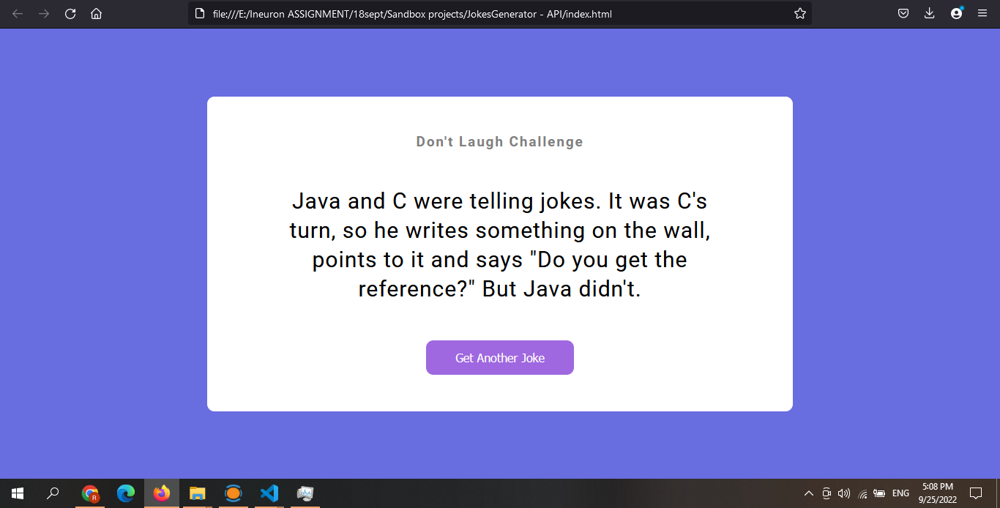

# JS ASSIGNMENT 7

Binary to decimal conversion

### default:

### output:

It took me around 2.5 hours to complete it.

Technology Used:

- HTML
- CSS
- JAVASCRIPT

Live Demo: [Link](https://js-jokes-generator.netlify.app/)
